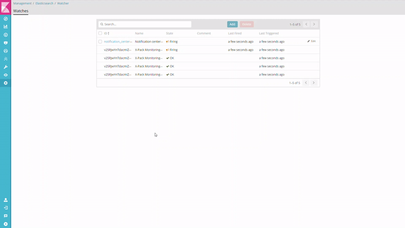

# Notification Center

Notification Center is a kibana plugin for better experience of notifier toasts.



## Features

### Webhook Endpoint

Provides a webhook endpoint that can generate a notification toast.

This feature is useful with the x-pack alerting.

* See [API](#api) for usage.

### Notification History

You can see notification history in the notification center.(It's appear when you click the navbar button.)

This feature is useful when there are notifications that not be checked, such as when you are not looking at the screen.

In particular, you can check notifications received via [webhook](#webhook-endpoint) when you are not connected.

Of course, you can clear the checked notification.

> **NOTE: Not only notifications pushed through api, all notifications of generated by kibana's `Notifier` are displayed in notification center panel.**

## Installation

Copy installation file's url as same version of your kibana from [the repository releases](https://github.com/sw-jung/kibana_notification_center/releases).

And
```bash
$ cd path/to/your/kibana
$ bin/kibana-plugin install <installation file's url>
```

 If you want more information, See [this document](https://www.elastic.co/guide/en/kibana/current/_installing_plugins.html).

> **NOTE: How can I do if I cannot find version I want?**  
> I'm sorry for that. This plugin not all of kibana versions are supported.  
> If you need unsupported version, please test nearest version.  
> In this case, you need to modify the kibana.version field in package.json.  
> **Currently minimum support version is v5.4.3**

## Configuration

The following configurable options are set by default.

### kibana.yml

```yml
notification_center:
  enabled: true

  # Name of the index where pushed notification is stored.
  # You can use momentjs's date format in wrapped by `%{}`. See https://momentjs.com/docs/#/displaying/format/
  index: "notification-%{+YYYY.MM.DD}"

  # The index template is created when you start kibana.
  template:
    name: "notification_center_template"
    overwrite: false

  api:
    # If `false` then disable all of REST APIs.
    enabled: true
    # The maximum size of the notification that user can pull from the server in a single request.
    pull.maxSize: 100
```

## API

### Push notification

* **URL**: /api/notification_center/notification
* **Method**: POST|PUT
* **Data Params**
```javascript
{
  "type": "error|warning|info" // Default "info"
  "content": "Write your notification content here." // Required
}
```

* **Response**
```javascript
// 200 OK
{
  "acknowledged": true
}

// The others are error.
```
---

## development

See the [kibana contributing guide](https://github.com/elastic/kibana/blob/master/CONTRIBUTING.md) for instructions setting up your development environment. Once you have completed that, use the following npm tasks.

  - `npm start`

    Start kibana and have it include this plugin

  - `npm start -- --config kibana.yml`

    You can pass any argument that you would normally send to `bin/kibana` by putting them after `--` when running `npm start`

  - `npm run build`

    Build a distributable archive

  - `npm run test:browser`

    Run the browser tests in a real web browser

  - `npm run test:server`

    Run the server tests using mocha

For more information about any of these commands run `npm run ${task} -- --help`.
